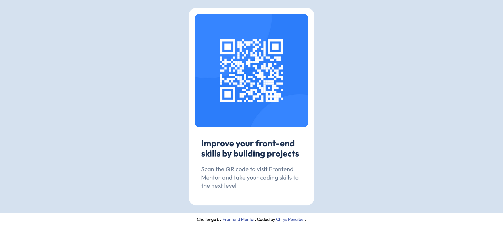

# Frontend Mentor - QR Code Component Solution

This is a solution to the [QR Code Component Challenge on Frontend Mentor](https://www.frontendmentor.io/challenges/qr-code-component-iux_sIO_H).

## Table of Contents

- [Overview](#overview)
  - [Screenshot](#screenshot)
  - [Links](#links)
- [My Process](#my-process)
  - [Built With](#built-with)
  - [What I Learned](#what-i-learned)
  - [Continued Development](#continued-development)
  - [Useful Resources](#useful-resources)
- [Author](#author)

## Overview

This is a simple and responsive QR Code component built using HTML and CSS. The design is structured and centered to provide a clean and accessible layout.

### Screenshot



### Links

- [Solution URL](https://github.com/chryspenalber/qr-code-component)
- [Live Site](https://chryspenalber.github.io/qr-code-component/)

## My Process

My process for creating this solution involved structuring the page with semantic HTML and applying CSS for styling and responsiveness. The design was built following the challenge's guidelines, ensuring proper alignment and spacing.

### Built With

- Semantic HTML5
- CSS custom properties
- Responsive design
- Google Fonts (Outfit)

**Semantic HTML Tags Used:**

```html
<main>

<h1>
<p>
<footer>
<a>
```

**CSS Features:**

- **@import:** Used to import the "Outfit" font from Google Fonts.
- **Selectors:**
  - `*`: Selects all elements.
  - `h1`, `p`: Targets text elements.
  - `.content`: Styles the text container.
  - `footer`: Styles the footer and attribution section.
- **Typography:**
  - Custom font family from Google Fonts.
  - Font sizes and weights adjusted for readability.
- **Box Model Adjustments:**
  - Applied `margin` and `padding` to position elements properly.
  - Used `border-radius` for rounded corners.

### What I Learned

This project reinforced my understanding of fundamental CSS properties, particularly margin, padding, and typography settings. I also practiced using Google Fonts and ensuring a responsive layout with minimal code.

### Continued Development

I aim to further develop my skills in:

- Using Flexbox and Grid for more complex layouts.
- Enhancing accessibility and semantic HTML practices.
- Exploring additional CSS pseudo-elements and animations.

### Useful Resources

- [MDN Web Docs - Box Model](https://developer.mozilla.org/en-US/docs/Web/CSS/box_model) - Helped clarify how margins and padding affect layout.
- [Google Fonts](https://fonts.google.com/) - Used to import and apply the "Outfit" font.

## Author

- GitHub - [Chrys Penalber](https://github.com/chryspenalber)
- Frontend Mentor - [@chryspenalber](https://www.frontendmentor.io/profile/chryspenalber)

